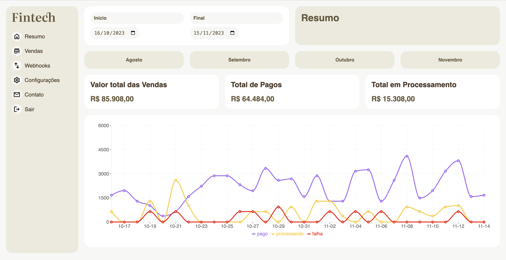
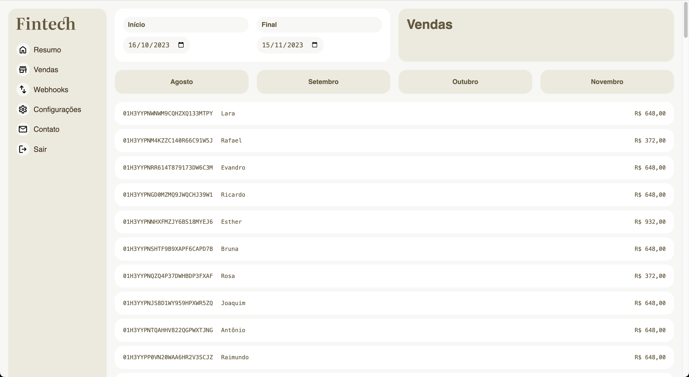
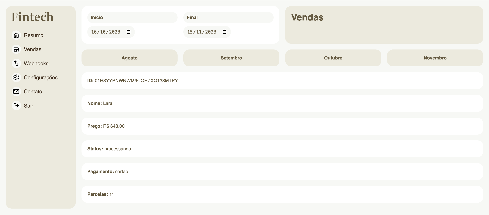

# 📊 Dashboard Fintech

O projeto **Fintech** foi desenvolvido durante o curso de React com TypeScript da Origamid.

Com consumo de uma API de vendas da própria plataforma do curso, a aplicação simula um dashboard com o faturamento de uma fintech. Nele é possível filtrar dados de vendas de um determinado período. Também é possível consultar detalhes individuais de cada venda.

#### Acesse a aplicação clicando [aqui](https://dashboard-fintech-origamid.vercel.app/)


## 🖼️ Preview







## 🛠️ Tecnologias e ferrementas utilizadas

- [TypeScript](https://www.typescriptlang.org/)
- [React](https://react.dev/)
- [Vite](https://vitejs.dev/)
- [ESLint](https://eslint.org/)
- [React Router Dom](https://www.npmjs.com/package/react-router-dom)
- [Recharts](https://recharts.org/en-US/)

## 💻 Instalando e rodando o projeto localmente
Para executar a aplicação em sua máquina localmente, certifique-se de ter o Node.js e um gerenciador de pacotes instalados antes de prosseguir com as etapas abaixo:


```bash
# Passo 1: Clone este repositório
$ git clone https://github.com/welisonw/fintech.git


# Passo 2: Acessa a pasta do projeto
$ cd fintech


# Passo 3: Instale as dependências
## pnpm 
$ pnpm install

## npm
$ npm install

## yarn
$ yarn install


# Passo 4: Inicie o projeto
## pnpm
pnpm run dev

## npm
npm run dev

## yarn
yarn run dev

# A aplicação estará disponível em http://localhost:5173.
```
